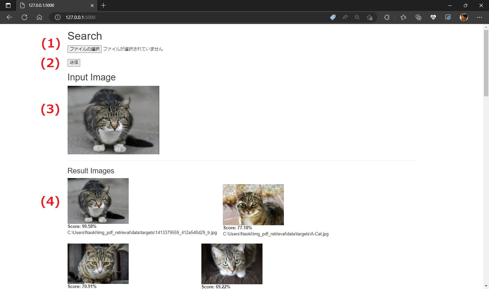

# img_pdf_retrieval

## Requirements

- Git
- Anaconda
- Python 3.7.2

## Setup

### Installation

Type below commands on the Analconda Prompt sequentially.

```
git clone https://gitlab.com/naoki.ohsugi/img_pdf_retrieval.git
cd img_pdf_retrieval
conda create -n img_pdf_retrieval python==3.7.2
conda activate img_pdf_retrieval
pip install -r requirements.txt
```

### Install `haarcascade_frontalface_default.xml`

Download [haarcascade_frontalface_default.xml](https://github.com/opencv/opencv/blob/4.x/data/haarcascades_cuda/haarcascade_frontalface_default.xml) and put it to `img_pdf_retrieval` folder.

### Setup for PDF search

If no need to search PDF files, the following setting can be skipped. Otherwise, download **poppler-windows** from [@oschwartz10612's repo](https://github.com/oschwartz10612/poppler-windows/releases/).
Please make sure to add the `bin/` folder to **PATH** or use `poppler_path = r"C:\path\to\poppler-xx\bin" as an argument` in `convert_from_path`.

Update **[FOLDERS]** section in `config.ini`

### Setup Target Folders

Open `config.ini`, change, and add the target folders to retrieve the image/PDF files. You can specify multiple folders with the serial numbers as follows.

```
[FOLDERS]
0 = C:\Users\<Uesr Name>\img_pdf_retrieval\data\targets\
1 = C:\...
2 = ...
```

## Indexing

Before booting server, need indexing

```
python indexing.py
```

It takes a few hours, according to the registered folders and the number of files found in your environment.

## Launching search server and open screen

```
python search_server.py
```


Open [http://127.0.0.1:5000/](http://127.0.0.1:5000/) on the browser.

## Search Server Screen

1.  Push button and select image to search.
2.  Push `Submit` button
3.  Input image to be shown in the area (3)
4.  Found images will be shown in the area (4)
    

## TODO

- Record the time stamp of the source files and skip already indexed and not updated files in the database.
- Running on the system tray and execute indexing periodically (e.g. every 12 hours).

# Credit

https://github.com/danghieuan/image-retrieval-system
